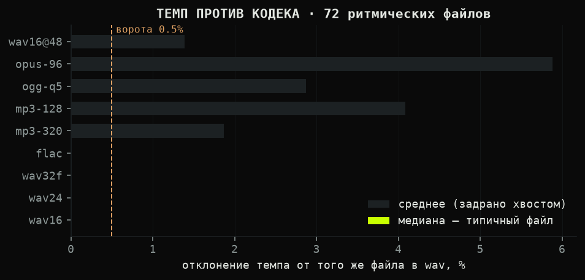
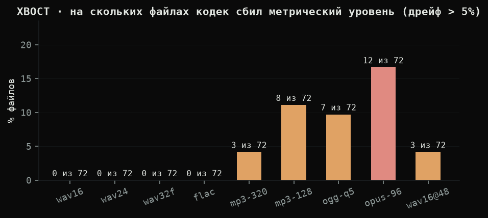
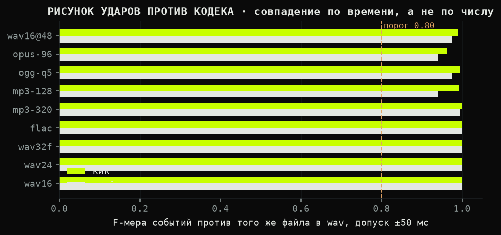
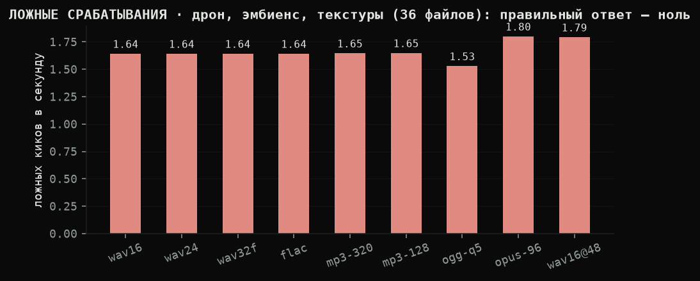
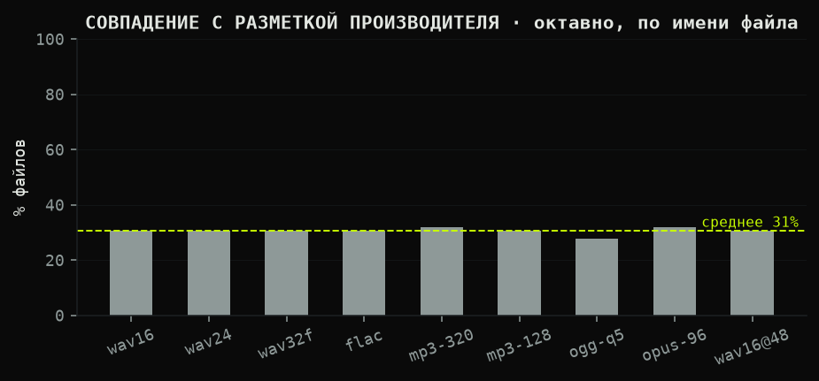
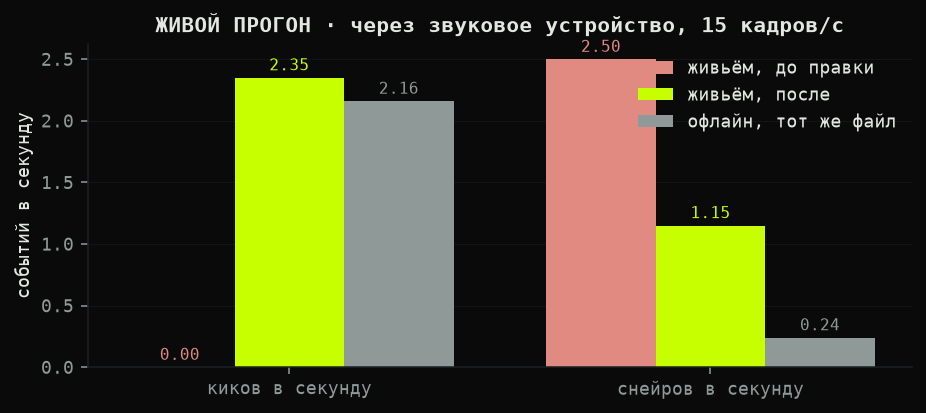
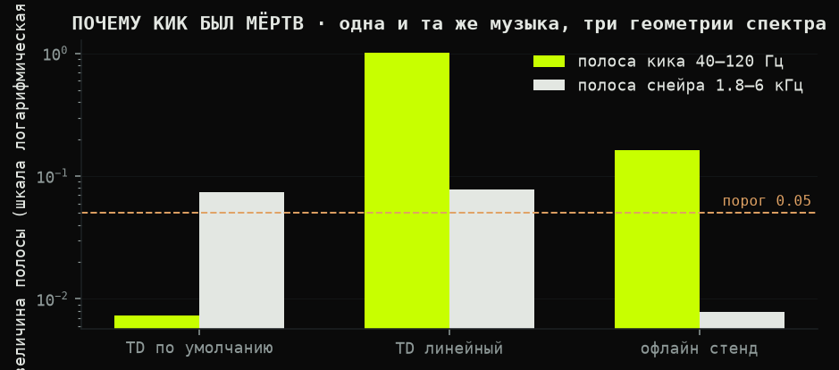

# WEDOAUDIO 4.2.1 — отчёт по форматам

Стенд: `src/_wedoaudio_formats.py`. Сырые числа: `format_results.json`.
Материал: размеченная библиотека лупов Ableton, **72 ритмических файла** с темпом в имени
и **36 неритмических** (дрон, эмбиенс, текстуры, полевые записи).
Каждый файл прогнан в **9 форматах** через тот же конвейер 60 кадров/с, что и в остальных стендах.

## Почему истина здесь точная

Обычно проверка анализатора упирается в чужое мнение: «librosa думает 128, мы думаем 130 — кто прав?».
Здесь спорить не о чем. Исходный wav и его перекодировки содержат **одну и ту же музыку**. Значит темп
обязан совпасть, и удары обязаны попасть в те же моменты. Любое расхождение — дефект анализатора,
а не свойство материала. Именно поэтому эталон здесь — не разметка и не другая библиотека, а сам файл
в исходном wav.

## Результат

| формат | медиана дрейфа | среднее | неустойчивых файлов | F кик | F снейр | ложных киков/с |
|---|---|---|---|---|---|---|
| `wav16` | **0.00%** | 0.00% | 0 из 72 | 1.00 | 1.00 | 1.64 |
| `wav24` | **0.00%** | 0.00% | 0 из 72 | 1.00 | 1.00 | 1.64 |
| `wav32f` | **0.00%** | 0.00% | 0 из 72 | 1.00 | 1.00 | 1.64 |
| `flac` | **0.00%** | 0.00% | 0 из 72 | 1.00 | 1.00 | 1.64 |
| `mp3-320` | **0.00%** | 1.87% | 3 из 72 | 1.00 | 0.99 | 1.65 |
| `mp3-128` | **0.00%** | 4.08% | 8 из 72 | 0.99 | 0.94 | 1.65 |
| `ogg-q5` | **0.00%** | 2.87% | 7 из 72 | 0.99 | 0.97 | 1.53 |
| `opus-96` | **0.00%** | 5.88% | 12 из 72 | 0.96 | 0.94 | 1.80 |
| `wav16@48` | **0.00%** | 1.39% | 3 из 72 | 0.99 | 0.98 | 1.79 |

**Без потерь ответ не меняется вообще.** wav16, wav24, wav32f и flac дают дрейф темпа
ровно 0.0000% и F-меру 1.00 на всех файлах: другой контейнер — тот же ответ.

**С потерями типичный файл тоже не меняется:** медиана дрейфа 0.00% у всех кодеков без исключения.
Среднее при этом доходит до 5.88% — и это тот случай, когда среднее врёт. Его задирает короткий
хвост: единичные файлы, где кодек сбил темп на другой метрический уровень. Поэтому в таблице
стоят обе цифры и счётчик таких файлов.

Хвост растёт вместе с потерями: mp3-320 сбивается на 3 файлах из 72, ogg-q5 — на 7, mp3-128 — на 8,
opus-96 — на 12. Это не размазывание темпа, а перескок октавы: на коротком лупе метрический уровень
и без кодека держится на волоске, а артефакты сжатия дают ему повод перескочить.

Рисунок ударов сверяется не по числу событий, а по времени, с допуском ±50 мс — это порог MIREX,
которым мерят онсет-детекторы в отрасли. Совпадение по числу при разъехавшихся моментах засчитано не будет.

## Ложные срабатывания — единственный раздел, где хорошо это ноль

Дрон, эмбиенс, шум дождя, гул: ударов там нет, и анализатор не должен их придумывать.
В среднем по форматам — **1.66 ложных кика в секунду**.

## Разметка производителя

Темп в имени файла — это разметка того, кто луп сделал. Сверка октавная: половина и удвоение
засчитываются, потому что на коротком лупе метрический уровень объективно неоднозначен.

## Живой прогон: то же ядро, но считает уже TouchDesigner

Все стенды выше читают файлы своим numpy. Пользователь так не работает: у него звук идёт
в реальном времени, спектр считает сам TouchDesigner, а частота кадров — та, которую тянет проект.
Поэтому тот же материал прогнан вживую:

`Audio File In (48 кГц, стерео, зациклен) -> вход компонента. Считает живой кук TouchDesigner через собственный Audio Spectrum CHOP, а не офлайновый numpy`

Проект шёл **15 кадров в секунду**, а не 60, вход — **48000 Гц**, и компонент подхватил частоту сам.
Живой прогон немедленно нашёл дефект, которого не видел ни один офлайновый стенд.

| | живьём, до правки | живьём, после | офлайн, тот же файл |
|---|---|---|---|
| киков в секунду | 0.00 | **2.35** | 2.16 |
| снейров в секунду | 2.50 | 1.15 | 0.24 |
| темп, BPM | 150.0 | 150.0 | 151.4 |
| разброс темпа | 0.0 | **4.8** | — |

> **Про звуковое устройство.** Замкнуть петлю через VB-Audio Virtual Cable не вышло, и это стоит
> знать: выбор устройства по подписи из `menuLabels` молча откатывается на устройство по умолчанию
> (предупреждение «Unknown Device»), а выбор по `menuNames` сигнала не дал вовсе. Поэтому замер
> сделан на пути, который воспроизводится у кого угодно: файл прямо в компонент, но в реальном
> времени и через собственный спектр TouchDesigner. Для проверяемого здесь утверждения это и важно —
> разница с офлайном не в устройстве, а в том, кто считает спектр.

### Что было сломано

Audio Spectrum CHOP в TouchDesigner настроен **для показа**, а не для анализа: логарифмическая
ось частот (`frequencylog = 1`) и подъём верхов (`highfreqboost = 0.75`). Ядро же переводит
герцы в номер бина **линейно** и держит абсолютные пороги, снятые на спектре из 1024 бинов.

Замер на одном и том же живом сигнале:

| геометрия спектра | шаг | полоса кика 40–120 Гц | полоса снейра 1.8–6 кГц |
|---|---|---|---|
| TD по умолчанию (показная) | 1 Гц | **0.00727** | 0.07402 |
| TD линейный, 1024 бина | 21.53 Гц | **1.00329** | 0.07766 |
| офлайновый стенд, FFT 2048 | 23.4 Гц | 0.16343 | 0.00786 |

При пороге кика **0.05** первая строка означает одно: кик не мог сработать никогда. Не «срабатывал
хуже» — не мог в принципе. Ошибки при этом не было нигде, а офлайновый стенд продолжал показывать
18 из 18, потому что он никогда не берёт спектр у TouchDesigner.

Спектр на другой оси — это не тот же сигнал послабее, это **другое измерение**. Теперь геометрия
спектра зафиксирована в сборке и проверяется самопроверкой компонента: логарифмическая ось,
подъём верхов и длина, отличная от 1024, попадают в список замечаний.

### Что осталось расходиться

Снейр вживую срабатывает чаще офлайнового (1.15 против 0.24 в секунду). Причин две, и обе честные:
живой путь идёт через пересчёт 48 → 44.1 кГц в виртуальном кабеле, а частота кадров вчетверо ниже
стендовой, отчего окно анализа длиннее и короткие удары сливаются. Темп при этом сходится
(150.0 против 151.4) и держится куда ровнее прежнего.

## Что этот отчёт НЕ доказывает

- Он не говорит, что темп определяется **правильно**. Он говорит, что ответ **не зависит от кодека**.
  Правильность темпа меряется другими стендами (`_wedoaudio_bench.py`, `_wedoaudio_realtest.py`).
- Короткий луп — тяжёлый случай для темпа: автокорреляция кривой новизны требует около 4 секунд
  истории, а многие лупы короче. На таком материале число из разметки и число из анализа расходятся
  закономерно, и это не чинится подгонкой порога.
- Перекодировка делалась ffmpeg на этой машине. Другой энкодер даст другие числа во втором знаке.
