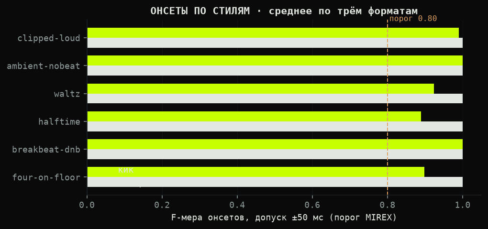
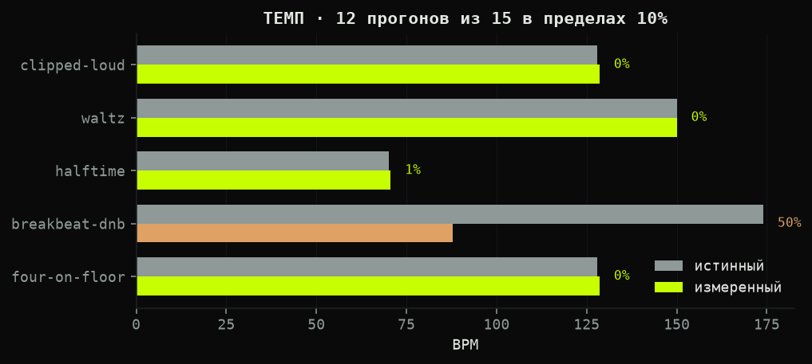
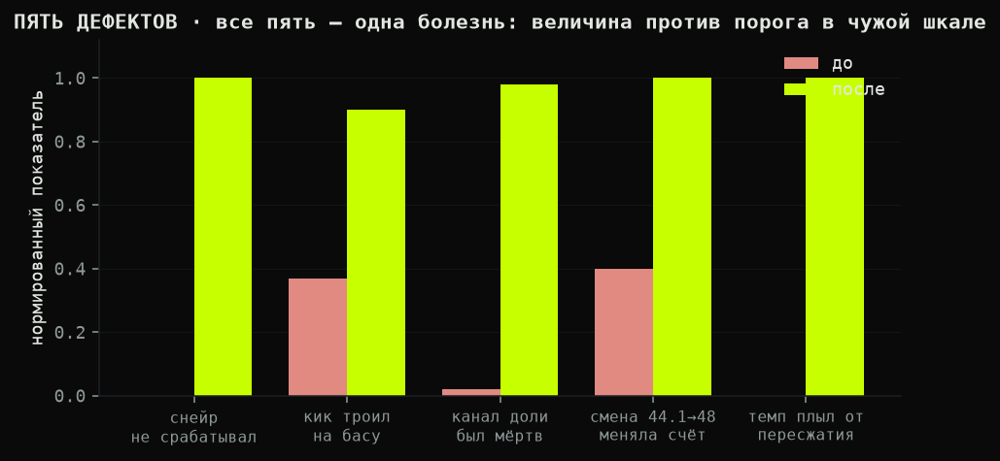

# WEDOAUDIO 4.2.1 — анализатор звука для TouchDesigner

Один компонент считает **22 признака звука за кадр** и отдаёт их именованной шиной (CHOP)
и спектр-текстурой (TOP). Ядро — чистый numpy, вшито внутрь компонента: ни плагинов, ни
бинарников, ни установки чего-либо в систему.

Компонент **самодостаточен**: ни одной ссылки наружу, ни одного сетевого узла, ассеты внутри.
Поставил в свою сеть, подключил звук — работает.

> Это инструмент анализа. Визуальная часть, шейдеры и пульты в поставку не входят и
> не публикуются — компонент отдаёт числа, что вы с ними сделаете, решаете вы.

---

## Установка

Скачайте **один** файл и перетащите в сеть:

| файл | кому | проверено |
|---|---|---|
| `WEDOAUDIO_4.2.1_TD2025.32460.tox` | **всем, если сомневаетесь** | собран в 2025.32460, загружен и проверен в 2025.33230: 22 канала, самопроверка чистая |
| `WEDOAUDIO_4.2.1_TD2025.33230.tox` | у кого 2025.33230 и новее | собран и проверен в 2025.33230 |

Сборка вынесена в имя файла не для красоты: тох, записанный новой версией TD, в старой
открывается с предупреждением или не открывается вовсе, а по содержимому это не видно.
Обратное направление безопасно, поэтому по умолчанию берите файл 32460 — он записан
старшим форматом и работает в обеих проверенных версиях.

Файлы не совпадают побитово (TD пишет свой формат), но собраны из одного исходника одним
скриптом, поэтому содержимое у них одинаковое: 16 узлов, 22 канала, те же умолчания.

Собираются оба скриптом `tools/build_portable.py`, руками не правится ничего. Хотите собрать сами:

```python
# в текстпорте TouchDesigner
import os; os.environ['WEDOAUDIO_REPO'] = r'C:/путь/к/wedoaudio'
exec(open(r'C:/путь/к/wedoaudio/tools/build_portable.py', encoding='utf-8').read())
```

---

## Быстрый старт

1. **Перетащите тох в сеть.** Появится узел `WEDOAUDIO`. На его плитке сразу видно шину
   признаков — если она шевелится, значит анализ идёт.
2. **Подайте звук на вход компонента.** Любой аудио-CHOP: `Audio File In`, `Audio Device In`,
   что угодно. Стерео сводится в моно само. Частота дискретизации берётся у входа — ничего
   выставлять не нужно.
3. **Читайте выходы.**
   - `out_features` — CHOP, 22 именованных канала;
   - `out_spectrum` — TOP, спектр для шейдеров.
4. **Проверьте параметр `Status`** на странице `WEDOAUDIO`. Он говорит, что происходит:
   `работает · 48000 Гц · 22 признаков` — всё в порядке; `нет спектра — подключите звук ко входу`
   — вход пуст; `интервал не измерен (первый кадр или разрыв)` — кадр пропущен намеренно:
   на первом кадре вычитать нечего, и подставлять заявленную частоту вместо измерения
   компонент не станет; `ошибка: …` — что именно сломалось.
   Молчаливых отказов у компонента нет.

Из Python:

```python
a = op('WEDOAUDIO')
a.op('out_features')['kick']        # значение канала
a.Reset()                           # сбросить состояние при смене источника
ok, замечания = a.Selftest()        # самопроверка: (True, []) если всё в порядке
a.Samplerate()                      # какая частота используется на самом деле
```

---

## Шина признаков (`out_features`, 22 канала)

| группа | каналы | что это |
|---|---|---|
| Уровень | `rms` `silence` | среднеквадратичный уровень входа · флаг тишины по гейту |
| Полосы | `bass` `mid` `high` | энергия трёх полос, границы задаются параметрами |
| Тембр | `centroid` `flatness` `rolloff` | центр тяжести спектра · шумность · частота спада |
| Новизна | `flux` | выпрямленный спектральный поток, основа всех детекторов |
| Кик | `kick` `rawkick` `kickband` | огибающая с затуханием · одиночный фронт · энергия полосы |
| Снейр | `snare` `rawsnare` `snareband` | то же для снейра |
| Доля | `beat` `rawbeat` | широкополосный онсет с адаптивным порогом |
| Темп | `bpm` `beatphase` | темп по автокорреляции новизны · фаза доли 0…1 |
| Динамика | `transient` `sustain` | ударное против тянущегося |
| Телеметрия | `agcgain` | текущее усиление автоуровня |

`rawkick` / `rawsnare` / `rawbeat` — импульсы в один кадр, для триггеров.
`kick` / `snare` / `beat` — огибающие с затуханием, для плавных величин.

---

## Настройка и калибровка

Все параметры на одной странице `WEDOAUDIO`, у каждого есть подсказка. Порядок настройки —
снизу вверх по сигналу; крутить наугад бессмысленно, каждый шаг проверяется по конкретному каналу.

**Шаг 1. Убедитесь, что звук доходит.** Смотрите `rms`. Тишина на входе — `silence` = 1.
Если `rms` шевелится, а `silence` всё равно 1, поднимите порог: `Inputgate` (умолчание 0.001).

**Шаг 2. Автоуровень.** `Agc` включён по умолчанию и подтягивает тихий материал.
`Agctarget` (0.7) — к какому уровню стремиться, `Agcmaxgain` (12) — потолок усиления.
Если на тихом материале лезет шум — опустите потолок. Смотрите канал `agcgain`:
он показывает, во сколько раз сейчас усиливает.

**Шаг 3. Полосы.** `Bassmaxhz` (250), `Midmaxhz` (2000), `Highmaxhz` (20000) — границы.
`Bassgain` / `Midgain` / `Highgain` — добавка к готовому значению, если полоса выходит слишком
вялой. Проверять по каналам `bass` / `mid` / `high` на знакомом материале.

**Шаг 4. Кик и снейр.** Сначала полосы, потом пороги — не наоборот.
`Kickbandlo` / `Kickbandhi` (40…120 Гц) и `Snarebandlo` / `Snarebandhi` (1800…6000 Гц) —
где искать удар. Смотрите `kickband` и `snareband`: там должно быть отчётливое движение
на ударах и мало между ними. **Ноль в границе полосы недопустим** — полоса схлопнется, и
детектор умрёт молча.

Дальше пороги:
- `Kickfloor` (0.40) — какую долю собственного затухающего пика полосы обязан превысить удар.
  Больше — строже, пропусков больше; меньше — срабатываний больше, ложных тоже.
- `Kicksensitivity` (1.6) — во сколько раз всплеск должен превысить недавний фон.
- `Kickrefractoryms` (110) — сколько миллисекунд после удара новый не засчитывается.
  Поднимайте, если кик «троит» на одном ударе.
- `Kickguard` (0.05) — небольшой абсолютный порог, отсекающий срабатывания на почти тишине.

Для снейра и доли — те же четыре ручки с префиксами `Snare` и `Beat`.

**Шаг 5. Плавность.** `Smoothing` (0.08) — насколько медленно спадают огибающие
`kick` / `snare` / `beat`. Больше — вязче. На импульсы `rawkick` не влияет.

**Шаг 6. Темп.** `Tempoac` — темп по автокорреляции (умолчание, так надёжнее),
выключить — вернуть счёт по интервалам между ударами. `Tempofix` подтягивает явные
удвоения и половины к основному уровню. Объявленный диапазон — 68…200 BPM.

**Служебное.** `Samplerate` = 0 означает «взять частоту у входа» — так и оставьте.
`Rate` — считать каждый N-й кадр, если машина не тянет; время пересчитывается, темп не врёт.
`Onsetrel` выключить — вернуть поведение версии 4.2.0 в точности, если новые детекторы
чем-то не устроили. `Reset` — сбросить состояние при смене источника.

**Если что-то не работает** — нажмите `Selftest()` из Python или посмотрите `Status`.
Самопроверка отдельно ловит частые причины: сбитую геометрию спектра, параметры с нулевым
умолчанием, ссылки наружу компонента, сетевые узлы внутри.

---

## Что проверено и на чём

Мы выкладываем не только код, но и цифры, на которых он держится.

| стенд | материал | результат |
|---|---|---|
| `src/_wedoaudio_test.py` | синтетика | 14 из 14 |
| `src/_wedoaudio_timbre_test.py` | синтетика | 14 из 14 |
| `src/_wedoaudio_bench.py` | 6 стилей × 3 формата, конвейер 60 к/с | кики 18/18, снейры 18/18, темп 12/15 |
| `src/_wedoaudio_realtest.py` | точная разметка, чужая музыка, 7 контейнеров | 6/6 · 4/4 · 6/6, дрейф 0.0% |
| `src/_wedoaudio_libtest.py` | размеченная библиотека лупов | темп 12/32, рядом librosa 13/32 |
| `src/_wedoaudio_formats.py` | 72 ритмических файла × 9 форматов | см. ниже |





Пять дефектов, найденных стендами и исправленных, — все оказались одной болезнью: величину
сравнивали с порогом в шкале, которой она не принадлежит.



**Форматы.** Без потерь ответ не меняется вообще: wav16, wav24, wav32f и flac дают дрейф
темпа **0.0000%** и F-меру **1.00** на всех 288 прогонах. С потерями типичный файл тоже не
меняется — медиана дрейфа 0.00% у всех кодеков, — но появляется хвост: метрический уровень
сбивается на 3 файлах из 72 у mp3-320, на 7 у ogg-q5, на 8 у mp3-128, на 12 у opus-96.
Подробности, графики и сырые числа — **[FORMAT_REPORT.md](FORMAT_REPORT.md)**.

**Живой прогон.** Тот же материал через живой кук TouchDesigner, на 15 кадрах в секунду,
со спектром от самого TD. Нашёлся дефект, которого не видел ни один офлайновый стенд:
Audio Spectrum CHOP создаётся настроенным **для показа** (логарифмическая ось частот, подъём
верхов), а ядро переводит герцы в номер бина линейно. Полоса кика читалась 0.007 при пороге
0.05, и кик не срабатывал **ни разу**: 0.00 в секунду против 2.16 в офлайне. После приведения
оси к линейной — 2.35 в секунду, темп 150.0 против офлайновых 151.4. Геометрия спектра теперь
часть контракта и проверяется самопроверкой.

Мораль, которая стоила дня: **спектр на другой оси — это не тот же сигнал послабее,
это другое измерение.**

---

## Известные ограничения

Пишем как есть, без округления в свою пользу.

- **Дрон и эмбиенс дают ложные срабатывания** — около 1.6 кика в секунду на неритмическом
  материале. Тянущийся звук с медленной пульсацией читается как удары. Дыра не закрыта.
- **Темп на коротких лупах ненадёжен.** Автокорреляции нужно около 4 секунд истории;
  совпадение с разметкой производителя — 31%.
- **Брейкбит читается как половина темпа** (88 вместо 174). Кривая новизны на нём честно
  периодична вдвое реже рисунка.
- **Разрешение онсетов — кадр.** На 60 к/с это 16 мс, на 30 к/с — 33 мс. Сэмпл-точного
  пути пока нет.
- **Автоуровень держит примерно 12-кратный диапазон**, дальше начинает вытягивать шум.
- **Компонент не даёт тональность и MFCC** — они есть в `src/wedoaudio_timbre.py`, но
  в переносимую сборку не включены.

---

## Роадмап

Порядок — по тому, сколько пользы на единицу работы, а не по интересности.

**4.3 — закрыть дрон.** Ложные срабатывания на тянущемся материале сегодня самая заметная
дыра. Направление: отделять удар от нарастания по форме огибающей, а не по одной величине
потока. Нужен размеченный материал: дроны, пэды, полевые записи, где ударов заведомо нет.

**4.4 — сэмпл-точные онсеты.** Отдельный путь по времени параллельно кадровому, чтобы
разрешение перестало зависеть от частоты кадров проекта. Даст точные триггеры на 30 к/с.

**4.5 — тембр и тональность в компонент.** `wedoaudio_timbre.py` уже написан и проверен
(MFCC, хрома, K-взвешенная громкость), осталось встроить и померить стоимость кадра.

**4.6 — устойчивость темпа на хвосте.** Разбор тех самых 12 файлов из 72, где opus сбивает
метрический уровень: понять, чем именно артефакт кодека тянет автокорреляцию, и добавить
подкрепление, которое это переживает.

**Без версии, по мере сил:** пресеты под жанры; выход по OSC для тех, кому нужен не CHOP;
профиль стоимости кадра на слабых машинах.

---

## Совместная разработка — что нужно от вас

Проект живёт замерами, а не мнениями. Самое ценное, что можно прислать, — не код, а **материал
и опровержение**.

**Нужнее всего:**
1. **Настоящая музыка с ручной разметкой ударов.** У нас её нет ни одной записи — это самая
   большая дыра во всей проверке. Даже минута размеченного вручную материала ценнее нового
   алгоритма.
2. **Случаи, где анализатор врёт.** Файл, ожидаемый ответ, полученный ответ. Этого достаточно,
   чтобы завести стенд.
3. **Стили, которых нет на стенде:** джаз со свингом, фолк, метал, эмбиент-техно, всё
   с нечётным размером.
4. **Замеры на другом железе и на других частотах кадров** — особенно на 30 к/с и ниже.

**Правила, которые мы соблюдаем сами и просим соблюдать:**
- ничего не чиним на глаз: правка принимается с числом до и числом после;
- регресс важнее улучшения — если правка чинит одно и ломает другое, она не принимается;
- умолчание меняется только под флагом отката;
- ограничение, которое не удалось снять, записывается в README, а не заминается.

Подробнее — в [CONTRIBUTING.md](CONTRIBUTING.md). Вопросы, находки и споры — в issues.
**wedoit — welcome.**

---

## Лицензия

CC BY-NC 4.0. Пользуйтесь, изменяйте, показывайте — со ссылкой и не в коммерческих целях.
